# HJ SNS

HJ's Social Network Service :couplekiss:

`Completed at 21.04.13`

## What is this?
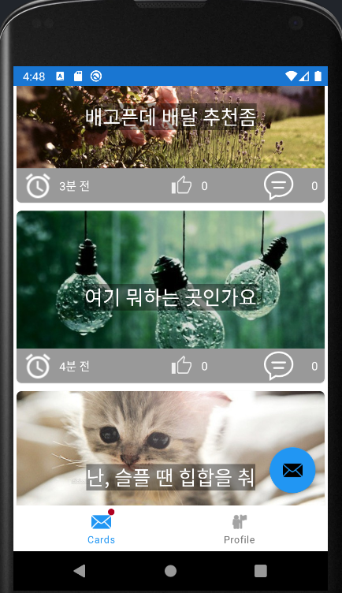

This is the Social Network Service Application anyone can post their card with comment on. 

## How it works
### Specification
- min SDK : 23
- Target SDK : 30  
- Implement : FirebaseAuth, FirebaseDB, FirebaseUI, RxAndroid, RxJava, RxLifeCycle, Glide
### Login Page

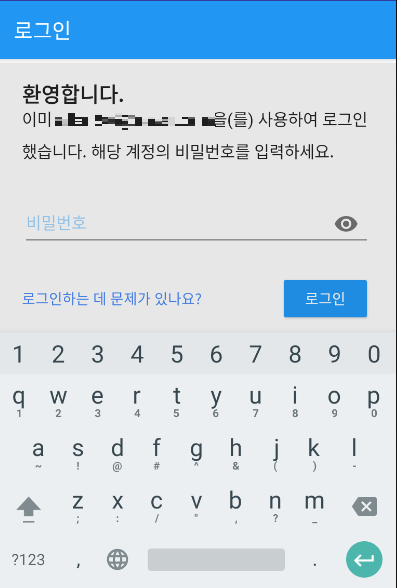

로그인 페이지입니다. Firebase의 삽입형 인증 솔루션을 이용합니다.  
Firebase Authentication과 데이터베이스에 등록된 유저인지 아닌지를 확인하고 인증 절차를 거칩니다.
### Card Page
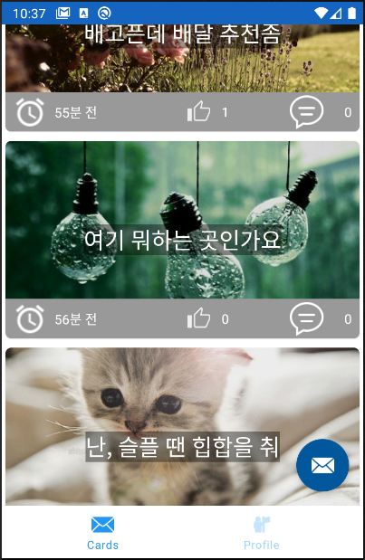

Main 화면인 Card Page입니다. MainActivity는 2개의 Fragment를 Bottom Navigation으로 순회할 수 있도록 했으며,
각각 Card Page, Profile Page로 구성되어 있습니다.
### Detail Card 
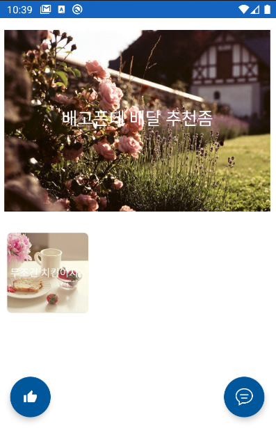

포스팅된 카드를 볼 수 있습니다.
### Adding Comment
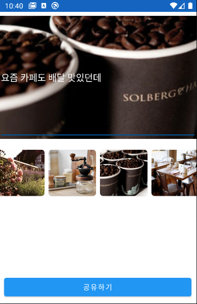

댓글을 달 수 있습니다.
### Detail Card Page After Add Comment
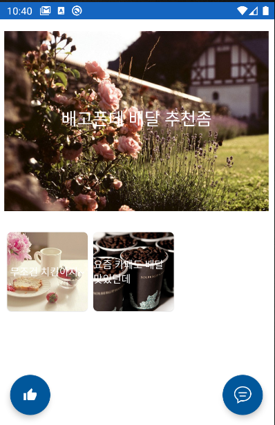

사용자가 댓글을 달면 누구나 실시간으로 업데이트 되는 모습을 볼 수 있습니다.
### Like the Card
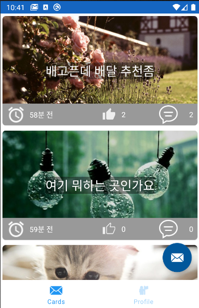

댓글과 마찬가지로 좋아요도 실시간으로 업데이트 됩니다.
### Card Context Menu
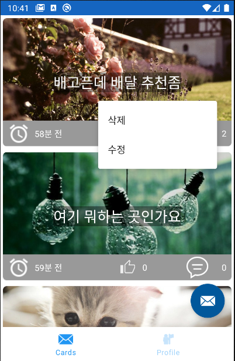

본인이 작성한 카드는 삭제 및 수정이 가능합니다.
### Deleting Card
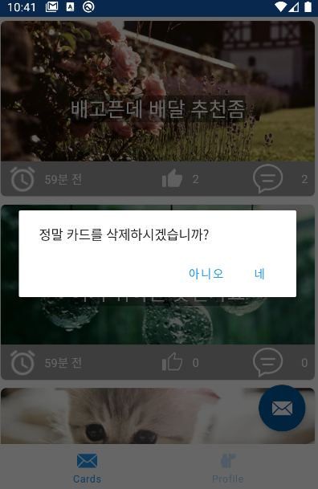

### After Removing Card
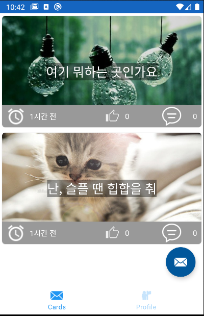

본인이 쓰지않은 카드에 대해서는 개발자에게 신고를 할 수 있습니다.
### Report Card
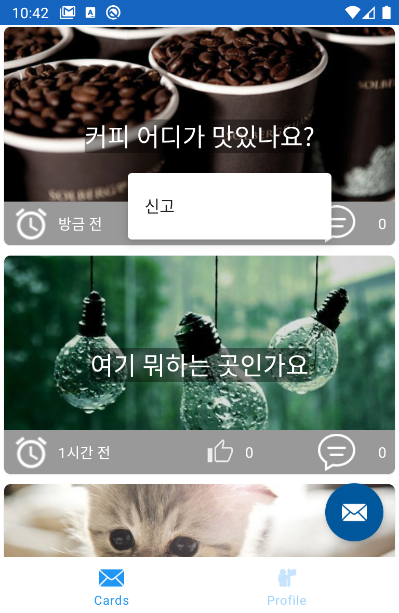

본인이 쓰지않은 카드에 대해서는 개발자에게 신고를 할 수 있습니다.
### Send Report Email to Developer
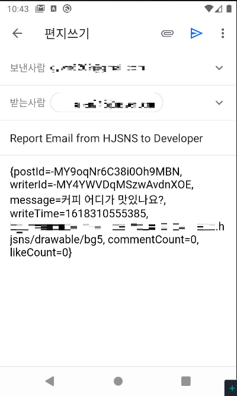

이렇게 개발자에게 Post의 정보를 담아 Email을 보낼 수 있습니다.
### Writing Card
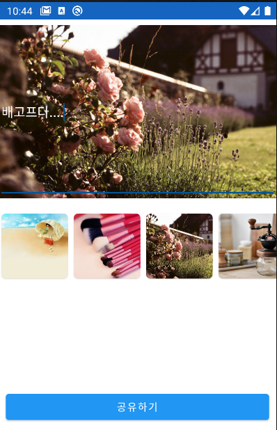

카드를 작성해 모두에게 공유할 수 있습니다.
### After Writing Card
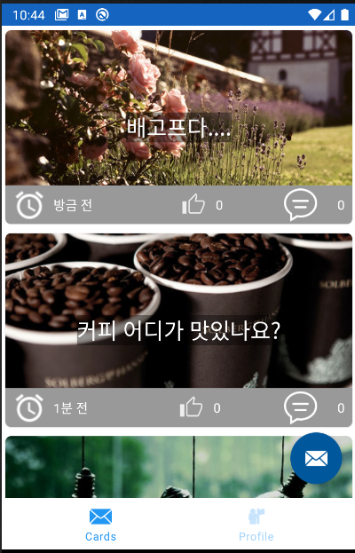

카드를 작성하면 모든 사용자에게 실시간으로 업데이트되며, 맨 위에 스크롤되어있다면 자동으로 스크롤이 내려가며 갱신됩니다.
### Adding Comment
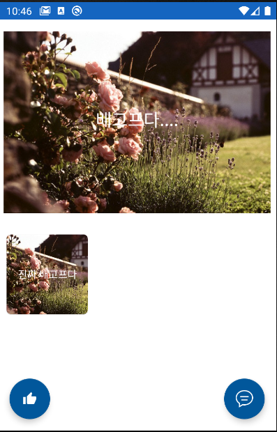

### Profile Page
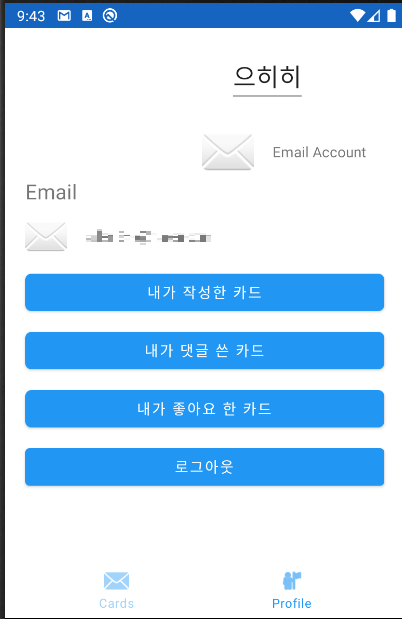

카드 작성과는 별개로 이 Fragment에서는 사용자의 개인정보를 확인할 수 있으며 이름을 변경할 수 있습니다.
### My Cards
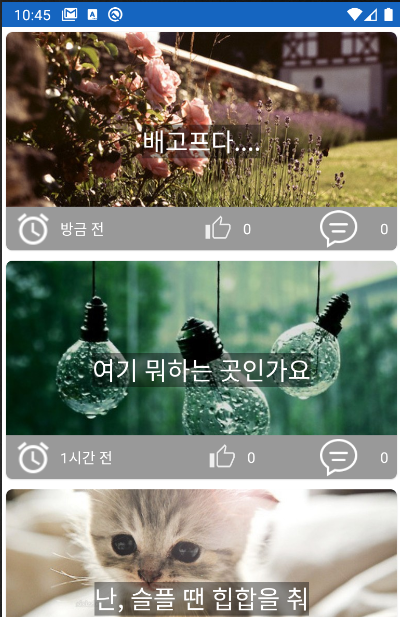

사용자가 작성한 카드목록을 볼 수 있습니다.
### My Commented Cards
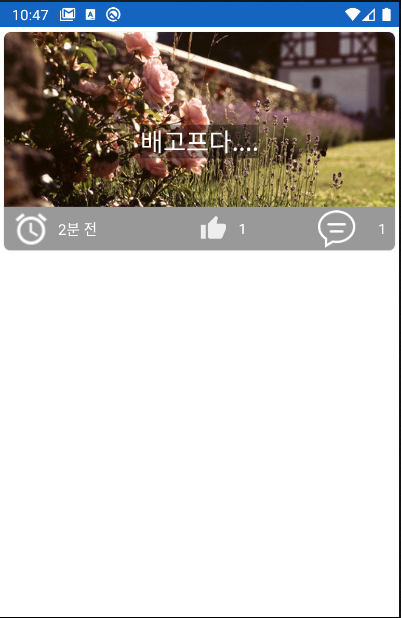

사용자가 댓글을 단 카드들을 볼 수 있습니다.
### My Liked Cards
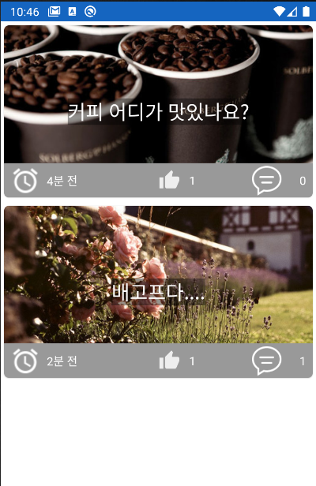

사용자가 좋아요를 누른 카드들을 볼 수 있습니다.
### Before Change User Name in DB
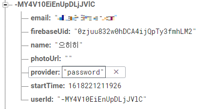

Database에서 사용자가 이름을 수정하기 전의 Snapshot입니다.
### Changing User Name in App
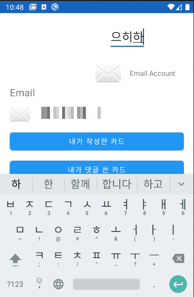

사용자가 이름을 바꿀 수 있습니다.
### Before Change User Name in DB
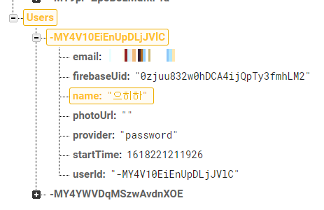

사용자가 이름을 바꿀 때마다 Transaction으로 실시간으로 DB를 업데이트합니다.
### Sign Out
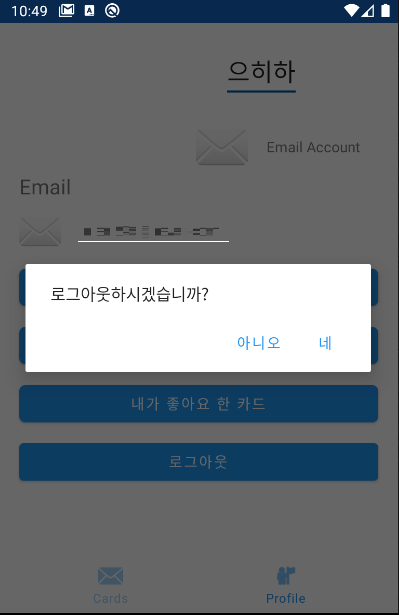

사용자는 로그아웃을 할 수 있습니다.
### After Sign Out
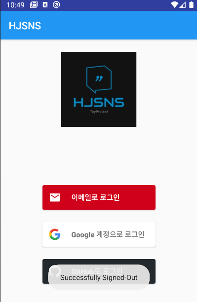

로그아웃을 하면 성공했다는 알림이 뜨고 맨 처음 로그인 화면으로 돌아갑니다.
### Database State
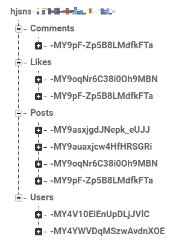

여기까지의 과정이 모두 업데이트 된 DB 상태입니다.
### Another User in Google Account
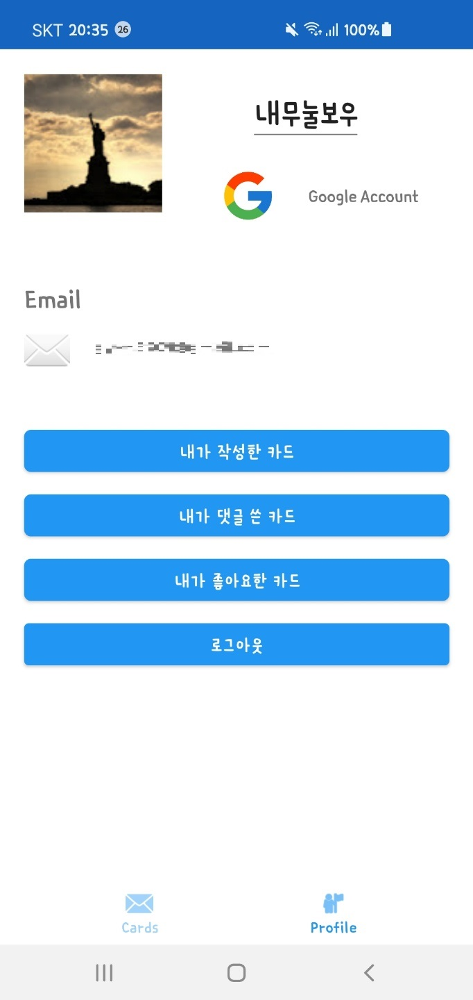

이번엔 스마트폰으로 구글계정으로 동시에 접속중인 유저의 Profile 입니다.
### Another User in Card Fragment
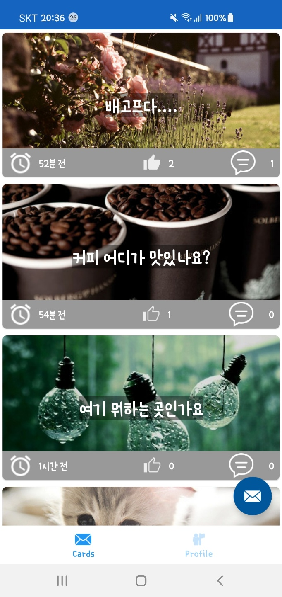

다른 유저의 시점에서도 실시간으로 다른 유저의 활동이 업데이트됩니다.

## Primary To-do List 
- [X] Complete Activity Layout (done at 21.04.04)
- [X] Make Bottom Navigation View (done at 21.04.04)
- [X] Introduce FireBase RealTime DB (done at 21.04.05)
- [X] Complete Comment System (done at 21.04.06)
- [X] Complete Like System Using Transaction (done at 21.04.08)
- [X] Set Comment and Like System along with Post (when post removed, comment and like should be removed too.) (done at 21.04.08)
- [X] Add FloatingContextMenu to Implement Modify Operation in Post&Comment Using Firebase Transaction (done at 21.04.07)
- [X] Add FloatingContextMenu to Implement Remove Operation in Post&Comment (done at 21.04.08)
- [X] Add Report-to-Developer System (done at 21.04.12)
- [X] Introduce FireBase Authentication (done at 21.04.08)
- [X] Apply AuthInfo to Profile Information (done at 21.04.09)
- [ ]  ~Add SharedPreference for Profile Info (you shouldn't do this!)~
- [X] Manage User Info in DB, not Device ID (done at 21.04.11)
- [X] Add User Profile Modification Function (done at 21.04.12)
- [X] Show Cards, Comments, and Likes of User in Profile Fragment (done at 21.04.10)
- [X] Automatically Scroll Up at Top of Items (done at 21.04.04)
- [ ] ~Add Photo Uploading System in Posting Operation (You have to implement File Server for this...)~
- [ ] ~Introduce FCM Service for New Message (You have to implement Node.js Server for this...)~
- [ ] ~Add Observer Patterns such as Cards Badge (should work with FCM Service)~
- [ ] Save UI State with LifeCycle(Preserve Data When Screen Rotates, Listener Restoration)

----------------
### Secondary To-do List 
- [X] Make UI Better Using Material Design (done at 21.04.06)
- [X] Add Dark/Light Theme
- [ ] Make User Choose Light/Night Theme
