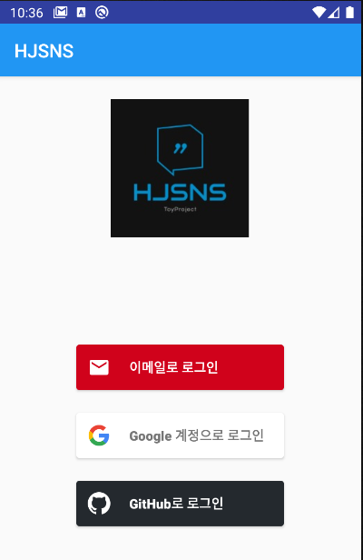

# HJ SNS

HJ's Social Network Service :couplekiss:

## What is this?

This is the Social Network Service Application anyone can post their card with comment on. 

## How it works

## Primary To-do List 
- [X] Complete Activity Layout (done at 21.04.04)
- [X] Make Bottom Navigation View (done at 21.04.04)
- [X] Introduce FireBase RealTime DB (done at 21.04.05)
- [X] Complete Comment System (done at 21.04.06)
- [X] Complete Like System Using Transaction (done at 21.04.08)
- [X] Set Comment and Like System along with Post (when post removed, comment and like should be removed too.) (done at 21.04.08)
- [X] Add FloatingContextMenu to Implement Modify Operation in Post&Comment Using Firebase Transaction (done at 21.04.07)
- [X] Add FloatingContextMenu to Implement Remove Operation in Post&Comment (done at 21.04.08)
- [X] Add Report-to-Developer System (done at 21.04.12)
- [X] Introduce FireBase Authentication (done at 21.04.08)
- [X] Apply AuthInfo to Profile Information (done at 21.04.09)
- [ ]  ~Add SharedPreference for Profile Info (you shouldn't do this!)~
- [X] Manage User Info in DB, not Device ID (done at 21.04.11)
- [X] Add User Profile Modification Function (done at 21.04.12)
- [X] Show Cards, Comments, and Likes of User in Profile Fragment (done at 21.04.10)
- [X] Automatically Scroll Up at Top of Items (done at 21.04.04)
- [ ] ~Add Photo Uploading System in Posting Operation (You have to implement File Server for this...)~
- [ ] ~Introduce FCM Service for New Message (You have to implement Node.js Server for this...)~
- [ ] ~Add Observer Patterns such as Cards Badge (should work with FCM Service)~
- [ ] Save UI State with LifeCycle(Preserve Data When Screen Rotates, Listener Restoration)

----------------
### Secondary To-do List 
- [X] Make UI Better Using Material Design (done at 21.04.06)
- [X] Add Dark/Light Theme
- [ ] Make User Choose Light/Night Theme
